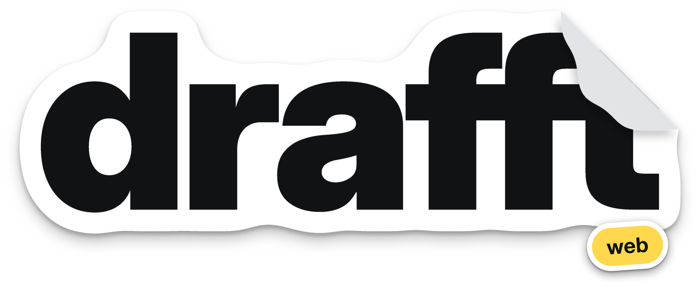
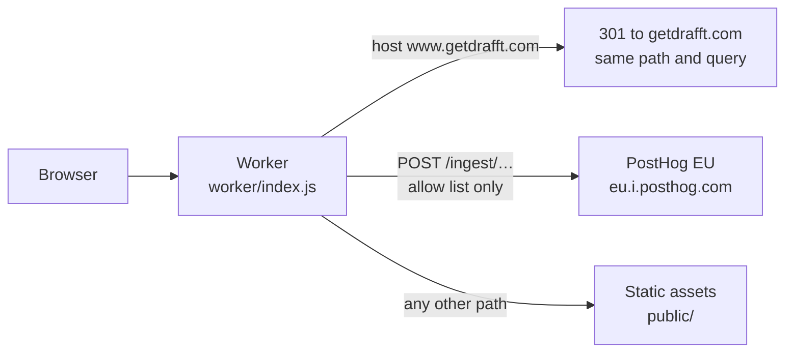

<div align="center">



**Meet someone who gets your rhythm.**

[getdrafft.com](https://getdrafft.com): the website of drafft, the dating app for people who train.<br>
The home page, the legal pages the apps open, and the account deletion page, in 7 languages.

[](https://github.com/sylwaninn/drafft-web/actions/workflows/ci.yml)
[](https://github.com/sylwaninn/drafft-web/actions/workflows/pr.yml)


[How it works](#how-it-works) | [Getting started](#getting-started) | [Deploy](#deploy) | [Docs](#documentation)

</div>

## How it works

Static HTML, CSS and JS in `public/`, with no framework and no build step, served by one Cloudflare Worker with
static assets. The Worker runs first on every request (`run_worker_first`), so nothing skips its rules. Under
`/ingest/`, a path outside the allow list gets a 404 and a method other than POST a 405.



### Requests

| Step | What happens |
|---|---|
| Domains | `getdrafft.com` and `www.getdrafft.com` only; no `workers.dev` or preview URLs |
| Redirect | a `www.` host gets a 301 to the apex; `http` to `https` is the zone's Always Use HTTPS |
| Assets | `public/`, with the headers of `public/_headers`: a same-origin CSP (inline scripts allowed, for the legal pages' language redirect), no framing, HSTS, `nosniff`, no camera, microphone or location |
| Caching | `/fonts/`, `/vendor/` and `/img/` for a week; scripts and stylesheets are cache-busted with `?v=` (see [Getting started](#getting-started)) |

### Languages

- **Home page:** one HTML file, translated in the browser by `public/i18n.js` (7 languages). It takes the first
  browser language it knows, else English, then fills every `data-i18n` text, the title and the meta tags.
- **Legal pages:** `?lang=<code>` first (the apps pass it), else the browser's language, then English; each page
  moves to its own version ([docs/legal.md](docs/legal.md#languages)).

### Legal pages

`scripts/legal.mjs` builds them from `legal/`: 4 pages (`legal`, `privacy`, `terms`, `delete-account`) in every
language, written to `public/`, English at `/<page>` and the others at `/<lang>/<page>`. Contact details come
from `legal/entity.json` (`{{key}}`, `{{@key}}` for a link). `pnpm legal` fails on an unknown `{{key}}`, a page
without `<h1>` or a missing required anchor, and writes an empty value as a visible gap; `pnpm check` also
fails on a stale page or an empty value. Details: [docs/legal.md](docs/legal.md).

### Page views

`public/analytics.js` loads PostHog once the page is loaded and the browser idle, and counts page views and
time on page only: no cookie, no storage, no autocapture, no replay. It sends nothing with Do Not Track or
Global Privacy Control on, or on another host than `getdrafft.com`. Events go to `/ingest` on the same domain;
the Worker relays three PostHog paths only, POST only, 256 KiB at most, with four request headers
(`content-type`, `content-encoding`, `user-agent`, `accept-language`) plus the visitor's IP in
`x-forwarded-for`, which PostHog's cookieless hash needs and doesn't store. Details:
[docs/analytics.md](docs/analytics.md).

### Layout

| Path | What |
|---|---|
| `public/` | the site: `index.html`, `styles.css`, `main.js`, `i18n.js`, `analytics.js`, generated legal pages |
| `legal/` | legal page sources: texts per language, contact details |
| `worker/` | the Worker and its tests |
| `scripts/` | legal page generator, wording check, smoke test |

## Getting started

```sh
git config core.hooksPath .agents/git-hooks
pnpm install
pnpm dev       # http://localhost:8787, with the production headers
```

| Command | What |
|---|---|
| `pnpm legal` | rebuild the legal pages from `legal/` (commit them with the sources) |
| `pnpm check` | legal pages up to date and complete, then bundle without deploying |
| `pnpm wording` | the copy against WORDING.md's forbidden wording |
| `pnpm test` | the Worker: redirect, relay allow list, POST only, size limit |

When a script or stylesheet changes, bump its `?v=` in `index.html` (`main.js`, `i18n.js`, `styles.css`,
`analytics.js`), and `CSS_VERSION` or `ANALYTICS_VERSION` in `scripts/legal.mjs` for the legal pages.

## Deploy

There is no staging: pull requests go into `main`.

| When | CI |
|---|---|
| Pull request | `ci.yml`: title format; `pnpm check`, `pnpm test`, `pnpm wording`; `pnpm audit`, gitleaks, actionlint, zizmor, shellcheck. `pr.yml`: base branch, description, commit authors, no AI attribution, unsigned commits (a warning) |
| Push to `main` | `ci.yml`: the same checks, then `wrangler deploy` to production and a smoke test: `/` answers 200 with its CSP, and `www` and `http` land on `https://getdrafft.com/` |

The repository needs the variable `CLOUDFLARE_ACCOUNT_ID` and the secret `CLOUDFLARE_API_TOKEN` (template "Edit
Cloudflare Workers", this account and the `getdrafft.com` zone; the custom domains need Workers Routes and DNS on
the zone).

## Documentation

| Document | Read it when you |
|---|---|
| [WORDING.md](WORDING.md) | write any copy, in any language |
| [PRODUCT.md](PRODUCT.md) | need the product and its positioning |
| [docs/legal.md](docs/legal.md) | change a legal text, add a page or a language |
| [docs/analytics.md](docs/analytics.md) | touch page view measurement |
| [AGENTS.md](AGENTS.md) | run a coding agent, or need the repository rules |

## Related repositories

| Repository | Role |
|---|---|
| [drafft-ios](https://github.com/sylwaninn/drafft-ios) | iPhone app |
| [drafft-android](https://github.com/sylwaninn/drafft-android) | Android app |
| [drafft-backend](https://github.com/sylwaninn/drafft-backend) | Supabase, Edge Functions, media and support Workers |
| [drafft-sophros](https://github.com/sylwaninn/drafft-sophros) | moderation and support dashboard |

## License

Proprietary. Copyright © 2026 the drafft authors. All rights reserved. No permission is granted to use, copy,
modify or distribute this code without written consent.
